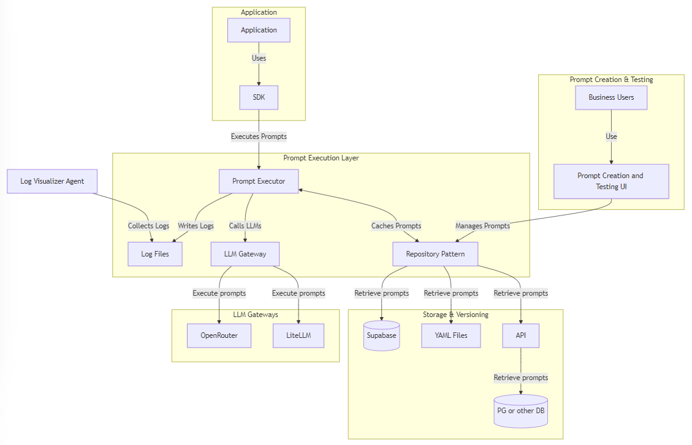

# Prompt Central Station (PCS) prompt execution SDK

The goal of Prompt Central Station (PCS) is to decouple prompt management from application code and enable 
non-technical users to modify prompts and parameters without code changes.

__Premise__:
- Business User Responsibilities:  write, test, and monitor prompt execution and effectiveness.
- Developer Responsibilities: integrate the prompt into the app business logic

## Prompt Management and Execution Pain Points
* Tight coupling of prompts, model parameters, and code, requiring code changes for prompt or model updates
* Inefficient process for adapting to new, potentially cheaper or better LLM models
* Developers, rather than business stakeholders, often making decisions about prompt content and model selection
* Lack of version control for prompts independent of code versioning
* Difficulty in managing and organizing prompts across different projects and business areas
* Inconsistent interfaces when working with multiple LLM providers
* Limited observability into prompt performance and usage patterns

## PCS Features

- Makes use of prompt management and versioning systems, supporting various repositories (YAML, Supabase, API)
- LLM gateway support, currently supporting OpenRouter but can be extended to other providers like LiteLLM
- Comprehensive logging system that can be consumed by managed logging services like Datadog
- Excellent developer experience, easy to use and extend

## Architecture
This SDK is intended to be the orchestrator of a full prompt management solution, allowing business users to 
create and test prompts without needing to have technical experience.  This greater architecture should also
allow developers to write code once and not have to change it when new models are added or when the prompt or 
its parameters or metadata needs to be updated.





## Configuration
Sample `.env` file in your project root with the necessary variables:

```
OPENROUTER_API_KEY=your_api_key_here

# Supabase respository
SUPABASE_URL=https://your-project-id.supabase.co
SUPABASE_KEY=your-supabase-api-key

# YAML repository
PROMPT_REPO_PATH=/path/to/your/prompt/repository 
LOG_DIR=./logs
```

## Setup

### YAML Repository
To use the YAML repository, you need to have a directory for your prompts, which  you will specify the location of 
using the `PROMPT_REPO_PATH` environment variable.  This directory can (and probably should) have subdirectories and 
be under version control. Each prompt should be a YAML file that follows the [Prompy schema](https://github.com/microsoft/prompty/blob/main/Prompty.yaml).

Some example prompty files can be found in the `/docs/prompty-examples` directory.

### OpenRouter
To use the OpenRouter LLM Gateway, you need to have an API key, which you will specify using the `OPENROUTER_API_KEY` 
in  your environment variables.  You can get an API key by signing up for an account at [OpenRouter](https://openrouter.ai/).
Note that there are free models you can use, so no payment is required to get started.

## Install in your project
Install the Prompt Execution SDK in your project by runing the following command:

```bash
pip install -e path/to/prompt-central-station
```

## Usage

Here's a quick example of how to use the Prompt Execution SDK with the YAML repository and OpenRouter LLM Gateway:

```python
import os
from dotenv import load_dotenv
from prompt_execution_sdk import PromptExecutor, SupabasePromptRepository, LLMGateway, Logger

# Initialize components
base_path = os.getenv('PROMPT_REPO_PATH')
repository = YAMLPromptRepository(base_path)
llm_gateway = LLMGateway(api_key=os.getenv('OPENROUTER_API_KEY'))
logger = Logger(log_dir=os.getenv('LOG_DIR', './logs'))

# Create the executor
executor = PromptExecutor(repository, llm_gateway, logger)

# Execute a prompt
result = executor.execute_prompt("intro/greeting-prompt", {"name": "Alice"})
print("Execution Result:", result)
print("Message:", result["choices"][0]["message"]["content"])
```

Notice that the `execute_prompt` method prompt ID is the full path to the prompt file in the reposoitory. 
The second argument is a dictionary of parameters that will be passed to the LLM model. 
Because we use OpenRouter, regardless of the LLM called we should receive the response in the format `result["choices"][0]["message"]["content"]`.

## Logging
The SDK uses the `Logger` class to log information about prompt execution.  The logger will log to files specified in 
the `LOG_DIR` environment variable.  These can then be consumed by a managed logging service like Datadog.

## Development

To set up the development environment:

1. Clone the repository
2. Create a virtual environment: `python -m venv venv`
3. Activate the virtual environment:
   - On Windows: `venv\Scripts\activate`
   - On Unix or MacOS: `source venv/bin/activate`
4. Install the development dependencies: `pip install -r requirements.txt`


## Contributing
Contributions are welcome! Please feel free to submit a Pull Request.

## License
This project is licensed under the MIT License.